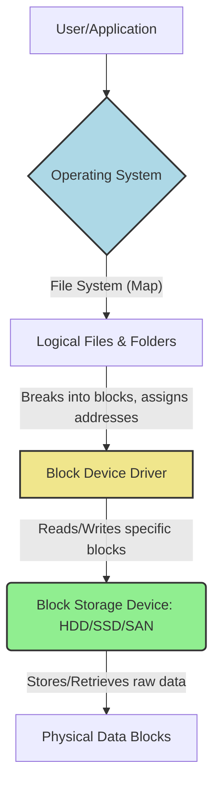

Have you ever wondered what truly happens when you click on a file, open an application, or save a document on your computer? How does your machine _actually_ find and store all that digital information? Today, we're going to uncover the fundamental mechanism behind this everyday magic: **Block Storage Devices**.

#### How Does Your Computer "See" Data?

Imagine your computer's storage as a massive, meticulously organised warehouse. When you're working with files and folders, your operating system (like Windows, macOS, or Linux) acts as a clever librarian, keeping track of where everything is. But at a much lower, more fundamental level, the actual storage hardware doesn't "see" files in the same way you do. Instead, it sees data in small, uniformly sized chunks called **blocks**.

#### Introducing Blocks: The Building Blocks of Data Storage

A **block** is the smallest unit of data that a storage device can read or write. Think of it like a perfectly sized, individual brick in a wall. Each of these bricks has a unique address, much like a specific house number on a very long street. When your computer needs to store a piece of data, it doesn't just throw it onto the disk; it meticulously places it into one or more of these blocks. Similarly, to retrieve data, it goes directly to the block's address.

#### The Role of the Operating System

You might be thinking, "But I interact with files and folders, not blocks!" And you're absolutely right! This is where your **Operating System (OS)** comes into play.

The OS acts as the sophisticated translator between your human-friendly view of files and the hardware's block-based reality. It maintains a **file system**, which is essentially a giant index or map. When you save a file, the OS breaks it down into blocks, finds available blocks on the storage device, writes the data to them, and then records _which_ blocks belong to _which_ file in its file system map.

When you open that file later, the OS consults its map, identifies all the blocks that constitute your file, and instructs the storage device to fetch them directly.

###### A Simple Analogy: The Librarian and the Storage Bins

Imagine you have a big library.
- **You (the User):** You ask for a book by its title ("My Awesome Document.docx").
- **The Operating System (the Librarian):** The librarian looks up "My Awesome Document.docx" in their master catalog. The catalog says, "This book is in storage bins #101, #102, and #105."
- **The Storage Device (the Warehouse of Bins):** The librarian then goes directly to bins #101, #102, and #105, retrieves the contents (the blocks of data), and assembles them back into your "book."

This process happens in milliseconds every time you interact with data on your computer!

